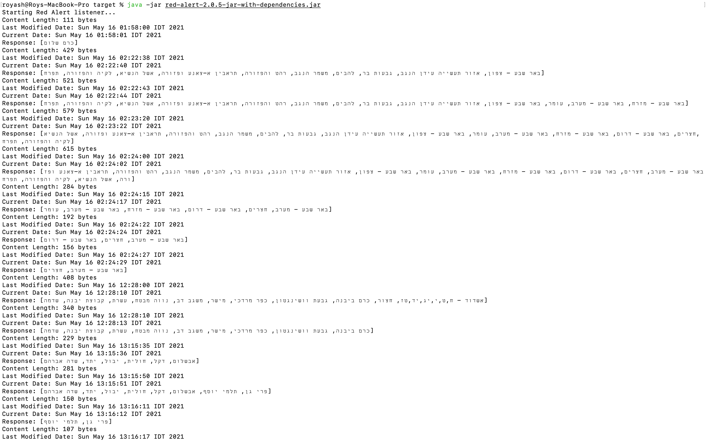
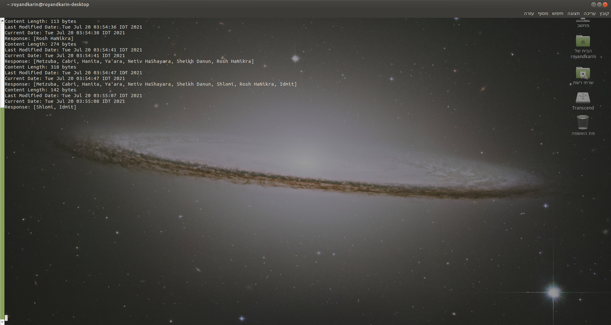

# red-alert-listener

## Requirements

1. Needs to be run from current working directory for being able to
   find [red-alert-listener.conf.json](red-alert-listener.conf.json) (or state the path to the settings file via `-s`
   flag).
2. [red-alert-listener.conf.json](red-alert-listener.conf.json) needs to be in the same directory as the `jar`
   file.
3. JDK 17 (or newer)
4. Must have an Israeli IP address.

## Capabilities

1. Display alerts as the Home Front Command produces them.
2. Make alert sound if the alert contains areas of interest defined
   in [red-alert-listener.conf.json](red-alert-listener.conf.json).
3. Supports all official languages:
	- Hebrew (code `HE`)
	- English (code `EN`)
	- Russian (code `RU`)
	- Arabic (code `AR`)

[comment]: <> (   Got it by running the following code on the DevTools console window on chrome)

[comment]: <> (   ```javascript)

[comment]: <> (   console.log&#40;JSON.stringify&#40;districts.reduce&#40;&#40;result, {label_he, label}&#41; => &#40;result[label_he] = label, result&#41;, {}&#41;&#41;&#41;)

[comment]: <> (   ```)

Legal districts (and their translation) can be found by:

1. Running `java -jar <downloaded-jar-file>.jar getRemoteDistrictsAsJSON -l <language code> | egrep -i "<district1>|<district2>[|...]"`

2. Saving those districts to file like
   this: `java -jar <downloaded-jar-file>.jar getRemoteDistrictsAsJSONToFile -l <language code> [-o <your-file-name>.json]` (
   the default file name is `districts.json`) and search in it as you may like.

## Demonstration




