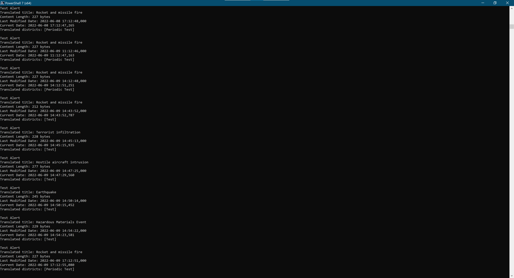
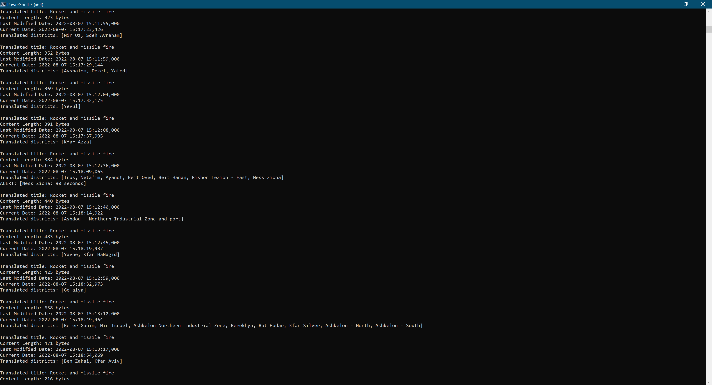
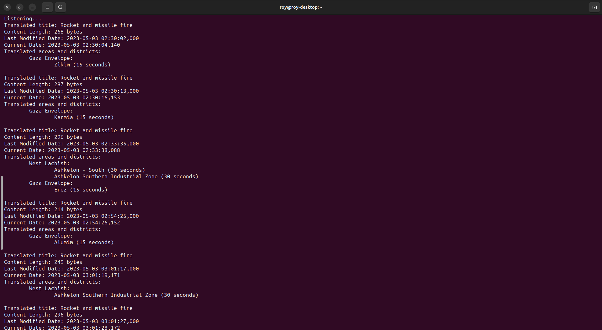
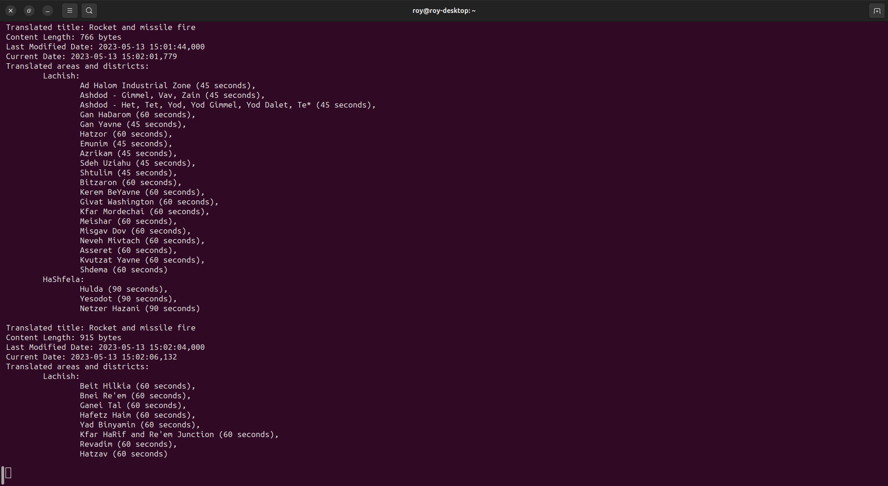

# red-alert-listener

## Requirements

1. [red-alert-listener.conf.json](red-alert-listener.conf.json) is being searched under current working directory by default (can be changed by stating the path (can be relative) to the configuration file via `-c` flag).
2. JRE 20 (or newer)
3. Must have an Israeli IP address.

## Capabilities

1. Display alerts as the Home Front Command produces them.
2. Make alert sound if the event contains areas of interest defined in [red-alert-listener.conf.json](red-alert-listener.conf.json).
3. Supports all official languages:
	- Hebrew (code `HE`)
	- English (code `EN`)
	- Russian (code `RU`)
	- Arabic (code `AR`)

[comment]: <> (   Got it by running the following code on the DevTools console window on chrome)

[comment]: <> (   ```javascript)

[comment]: <> (   console.log&#40;JSON.stringify&#40;districts.reduce&#40;&#40;result, {label_he, label}&#41; => &#40;result[label_he] = label, result&#41;, {}&#41;&#41;&#41;)

[comment]: <> (   ```)

Legal districts (and their translation) can be found by:

1. Running `java -jar <downloaded-jar-file>.jar get-remote-districts-as-json -l <language code> | egrep -i "<district1>|<district2>[|...]"`

2. Saving those districts to file like
   this: `java -jar <downloaded-jar-file>.jar get-remote-districts-as-json-to-file -l <language code> [-o <your-file-name>.json]`
   (the default file name is `districts.json`) and search in it as you may like.

## Known bugs

- On Raspberry Pi 4 with Ubuntu 22.10, alert sound isn't working.

## Demonstration







